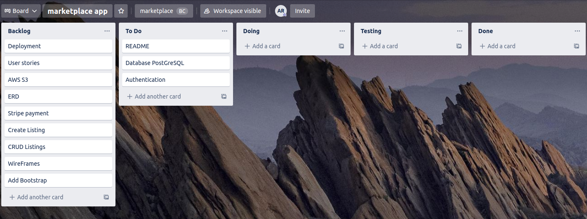

# T2A2 - Marketplace App

**Ananda Rodziewicz**

### Website

https://dashboard.heroku.com/apps/ancient-mesa-80940

### Github Repository

https://github.com/FluroWhiteSnow/marketplace_app

---

## What Problem is this site addressing?

Farming mushrooms is a lot of fun and hard work! It takes a lot of presicion and sterile procedures to be able
to farm mushrooms effectively. However, once you know what youre doing. Mushrooms grow extremely quickly
and are produced in very large amounts. If you really enjoy growing mushrooms as a hobby, within no time you
are going to far more mushrooms that you or your family and friends would need. Also at supermarkets, they
usually only stock standard portebellos and rarely any gourmet mushrooms.

## How is this app solving this problem?

As growing mushrooms can be extremely hard, my site allows you to connect with other users on the site to
discuss via messaging the process they have taken to grow their mushrooms, or to even talk about pricing of products,
or various other reasons you may want to talk to someone with more experience.
This allows beginners to ask questions with a real person, and engages them in a community.
As my app allows for the buying and selling of items, you can also list items to sell to other customer, so instead of your
product going to waste you are able to share it and profit instead!

## Purpose

A market place for sharing information on growing of mushrooms and to connect buyers to sellers.

## Target audience

This market place is targeting mushroom enthusiests and lovers, whether that be growers or consumers.
Allowing a connected marketplace allows for users to look for localy sourced and fresh mushrooms at a
potentially cheaper price than the supermarket.

---

## Functionality and Features

### User accounts

Anyone is able to view any listing. However to purchase items the must need to be logged in.
Users can create a secure account via the sign up page. Once they have signed up and logged in,
users are able to create listings, message users, and buy items.

### Messaging

As long as a user is signed in, they are able to message other users. They can find users via their user names
in the messages sections. They can also contact a specific buyer, by viewing a listing and clicking contact.
This is an active converstations sectionsm, where if you have messaged or recieved a message from a user, the users name
will go to that section.
If you have not messaged a particular user, they will be listed under the section start conversation

### Mushroom Listings

Users are able to create listing with a picture, description and price.
Users will only have the option to edit listings that are their own.
You are able to purchase items via the stripe api.
A webhook has been implemented to allow for a thank you for purchasing page
And to show you a recipet of your purchase.

## Site Map

**Key**
**Pink:** Anyone can view, no need to be logged in
**Green:** Need to be logged in to view / use


---

## Final website

## Tech Stake

### Front End

- HTML
- Bootstrap
- CSS
- Javascript

### Back End

- Ruby
- Ruby on Rails

### Database

- PostgreSQL

### Deployment

- Heroku

### Other

- AWS S3
- Devise Gem
- Stripe API
- UltraHook WebHook

---

## User Stories

**Visitor**

- As a visitor, I want to be able to view all listings
- As a visitor, I want to be able to create an account
- As a visitor, I want to be able to login to my new account

**user**

- As a user, I want to be able to list items to sell
- As a user, I want to be able to edit and update my listings
- As a user, I want to be able to message other users
- As a user, I want to be able to view a listing
- As a user, I want to be able to have a image for my listing
- As a user, I want to be able to have saved converstaions with users
- As a user, I want to be able to have my lisitng deleted after a user purchases
- As a user, I want to be able to delete my listing

## Privacy: Authentication and Authorisation

- As a user I do not want unauthorized people purchasing my listings
- As a user I do not want unauthorized people messaging me
- As a stocklist I do not want unauthorized people creating listings
- As a user I do not want unauthorized people editing my listings

 <br>

## High level components of the application

### Users accounts

This is one component of the application. Having user accounts allows us to have authorization
and enable security on purchases

### Listing

One of the main components of this website is the listings.
Allowing for listings gives users the ability to sell and purchase items at their will.
Adding descriptions and pictures to our listings is vital as it allows for us to make sure our listings stand out!

### Messaging

Messaging is an extra component of this site, not exactly needed if we just wanted to sell items.
However, having messaging allows for asking of questions and may help develop a community around mushrooms.

### Purchasing

Purchasing allows us to make payments and recieve products of our chosing.
Enabling online purchasing is vital if we want to facilitate transactions without a cash payment.

 <br>

## Third Party Applications

In my application I used a third party application **Stripe.** Stripe is a payment gateway system that allows for purchasing of items and the handeling of money. Doing this allowed for a much easier time implementing payments as a lot of was already done. I just had to work with their api and embedd it in my code.

I also used **Heroku**. Heroku is a platform as a service that allows developers to build run and operate applications on the cloud. They handle multiple languages and even have a free plan option for users. Heroku supplied me with a domain name storage for my main database.

I used **AWS s3 Bucket** to store my images. Storing my images within heroku would have been a lot slower to run the application as the free plan for heroku has quite slow loading speeds. It also just saves space and clutter within the main data base making it faster to run and search through.

I used **Ultrahook** as my stripe payment webhook. Ultrahook allows me to access a recent purchased item and manipulate it within a database. It allows for automated messages when a payment has occured from stripe, and using the messages I can manipulate what i want to happen. Such as showing a "thank you for purchasing page" or even a receiept (not implemented).

I used **Git + Github** for my version controll. Git allows me to make saves in certain times in my code. This allowed me to rollback any unwated or fatal mistakes i may have made within my code.

 <br>

### ERD AND MODELS

**Conversation Model**

```
	belongs_to :sender, foreign_key: :sender_id, class_name: 'User'
	belongs_to :recipient, foreign_key: :recipient_id, class_name:       'User'
	has_many :messages, dependent: :destroy
```

**Message Model**

```
	belongs_to :user
	belongs_to :conversation
```

**Listing Model**

```
	belongs_to :user
	has_many_attached :images
	has_one :purchase, dependent: :destroy
	validates :title, :price, presence: true
```

**Purchase Model**

```
	belongs_to :listing
	belongs_to :user
```

**User Model**

```
	has_many :listings
	has_many :purchases, dependent: :destroy
```

## ERD


## Project Management

To manage the workflow of my application i used Trello.
By using Trello I was able to focus on certain areas of what needed to be done in my website.
Doing this allowed me to be more organised and not forget small tasks tht needed to be done.
The tasks were broken in to 5 sections; backlog: consisting of all tasks that needed to be done,
to do: tasks that were next in priority to do, Doing; tasks I have started however yet to finish,
testing; this step ensured what i made worked as intened, lastly the done section was for all completed tasks.

### Trello Board 1



### Trello Board 2


### Trello Board 3


### Trello Board 4


### Trello Board 5


